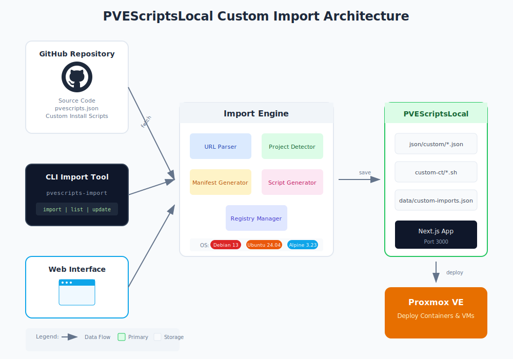
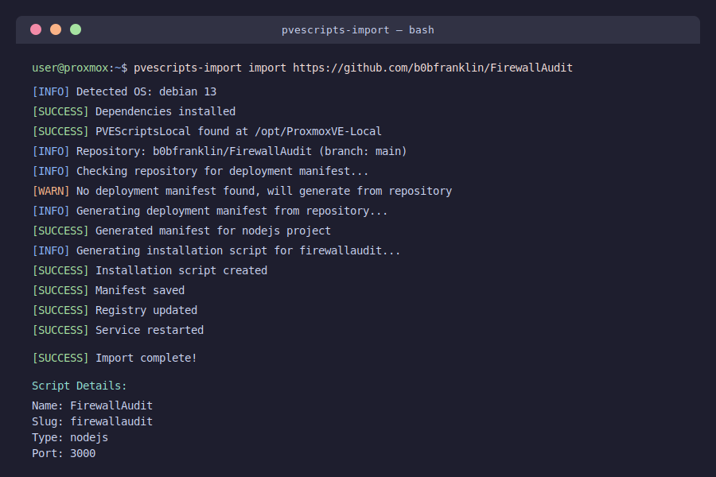
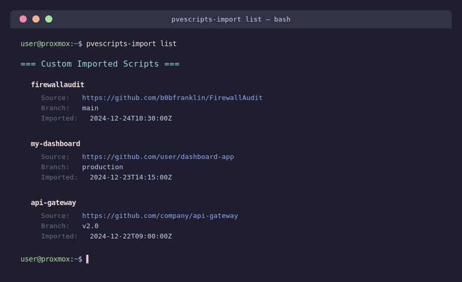

# PVEScriptsLocal Customiser

[](LICENSE)
[](https://github.com/community-scripts/ProxmoxVE)

Import custom projects into your PVEScriptsLocal installation from GitHub, community-scripts, and selfh.st for easy deployment as Proxmox containers or VMs.



## Features

- **Web Dashboard**: Browse and import scripts through a modern web interface (port 3001)
- **Multi-Source Import**: Import from GitHub, community-scripts.github.io, and selfh.st
- **CLI Import Tool**: Import GitHub repositories directly from command line
- **Auto-Detection**: Automatically detects project type (Node.js, Python, Docker, Go, Rust)
- **Multi-OS Support**: Deploy on Debian 13, Ubuntu 24.04 LTS, or Alpine 3.23
- **Custom Manifests**: Projects can include their own deployment configuration
- **Update Management**: Track and update imported scripts from source

## Supported Operating Systems

| OS | Version | Status |
|---|---------|--------|
| Debian | 13 (Trixie) | Fully Supported |
| Ubuntu | 24.04 LTS (Noble) | Fully Supported |
| Alpine | 3.23 | Fully Supported |

## Quick Start

### Web Dashboard Installation (Recommended)

The web dashboard provides a user-friendly interface to browse and import scripts from multiple sources.

```bash
# One-line install
bash <(curl -fsSL https://raw.githubusercontent.com/b0bfranklin/PVEScriptsLocalCustomiser/main/install-dashboard.sh)
```

After installation, access the dashboard at `http://your-server:3001`

The dashboard allows you to:
- **Community Scripts**: Browse 400+ scripts from community-scripts.github.io
- **selfh.st Apps**: Browse popular self-hosted apps with GitHub stars
- **GitHub Import**: Import any public GitHub repository
- **My Imports**: Manage, update, or remove your imported scripts

### CLI Installation

```bash
# Download the import script
curl -fsSL https://raw.githubusercontent.com/b0bfranklin/PVEScriptsLocalCustomiser/main/scripts/pvescripts-import.sh -o /usr/local/bin/pvescripts-import
chmod +x /usr/local/bin/pvescripts-import

# Import a GitHub repository
pvescripts-import import https://github.com/user/repo

# Import a specific branch
pvescripts-import import https://github.com/user/repo/tree/feature-branch

# List imported scripts
pvescripts-import list

# Update an imported script
pvescripts-import update my-app-slug

# Remove an imported script
pvescripts-import remove my-app-slug
```

#### CLI Import Example



#### CLI List Example



### Managing the Dashboard Service

```bash
# View logs
journalctl -u pvescripts-customiser -f

# Restart service
systemctl restart pvescripts-customiser

# Stop service
systemctl stop pvescripts-customiser

# Check status
systemctl status pvescripts-customiser
```

### Environment Variables

| Variable | Default | Description |
|----------|---------|-------------|
| `PVESCRIPTS_PATH` | `/opt/ProxmoxVE-Local` | PVEScriptsLocal installation path |
| `DASHBOARD_PORT` | `3001` | Port for the web dashboard |

## Creating a Deployable Project

To make your GitHub project easily deployable through PVEScriptsLocal, add a `pvescripts.json` manifest file to your repository root:

```json
{
  "name": "My Application",
  "slug": "my-app",
  "categories": [14],
  "type": "ct",
  "updateable": true,
  "privileged": false,
  "interface_port": 3000,
  "documentation": "https://github.com/user/my-app#readme",
  "website": "https://my-app.example.com",
  "description": "A brief description of your application",
  "source": {
    "type": "github",
    "owner": "user",
    "repo": "my-app",
    "branch": "main",
    "project_type": "nodejs"
  },
  "install_methods": [
    {
      "type": "default",
      "script": "custom-ct/my-app.sh",
      "resources": {
        "cpu": 1,
        "ram": 1024,
        "hdd": 8,
        "os": "debian",
        "version": "13"
      }
    }
  ],
  "default_credentials": {
    "username": null,
    "password": null
  },
  "notes": [
    {
      "text": "Access the web interface at http://<IP>:3000",
      "type": "info"
    }
  ]
}
```

See `templates/pvescripts.json` for a complete example with all available options.

## Project Type Detection

If no manifest is provided, the importer automatically detects project type:

| Files Detected | Project Type | Default Resources |
|----------------|--------------|-------------------|
| `package.json` | Node.js | 1 CPU, 1024MB RAM, 8GB disk |
| `requirements.txt` or `pyproject.toml` | Python | 1 CPU, 1024MB RAM, 4GB disk |
| `Dockerfile` or `docker-compose.yml` | Docker | 2 CPU, 2048MB RAM, 16GB disk |
| `go.mod` | Go | 1 CPU, 1024MB RAM, 4GB disk |
| `Cargo.toml` | Rust | 2 CPU, 2048MB RAM, 8GB disk |
| Other | Generic | 1 CPU, 512MB RAM, 4GB disk |

## Directory Structure

After installation, files are placed in:

```
/opt/ProxmoxVE-Local/
├── json/
│   ├── custom/                    # Custom manifest files
│   │   └── my-app.json
│   └── custom-my-app.json         # Symlink for discovery
├── custom-ct/                     # Custom installation scripts
│   └── my-app.sh
└── data/
    └── custom-imports.json        # Import registry
```

## API Reference

### CLI Commands

#### GitHub Import
| Command | Description |
|---------|-------------|
| `pvescripts-import import <url>` | Import a GitHub repository |
| `pvescripts-import import -c 8 <url>` | Import with specific category (8=Monitoring) |
| `pvescripts-import list` | List all imported scripts |
| `pvescripts-import remove <slug>` | Remove an imported script |
| `pvescripts-import update <slug>` | Update a specific import |
| `pvescripts-import update-all` | Update all imported scripts |
| `pvescripts-import categories` | Show available categories |

#### Community Scripts (community-scripts.github.io)
| Command | Description |
|---------|-------------|
| `pvescripts-import community-browse` | Browse available community scripts |
| `pvescripts-import community-search <term>` | Search for scripts |
| `pvescripts-import community-import <name>` | Import a script by name |

#### selfh.st Apps Directory
| Command | Description |
|---------|-------------|
| `pvescripts-import selfhst-browse` | Browse popular self-hosted apps |
| `pvescripts-import selfhst-search <term>` | Search for apps |
| `pvescripts-import selfhst-import <name>` | Import an app by name |

### Categories

Scripts can be placed in existing PVEScriptsLocal categories or in a new "Custom" category:

| ID | Category |
|----|----------|
| 1 | Automation |
| 2 | Database |
| 3 | Development |
| 4 | Docker |
| 5 | File Sharing |
| 6 | Home Automation |
| 7 | Media |
| 8 | Monitoring |
| 9 | Networking |
| 10 | Security |
| 11 | Storage |
| 12 | Utilities |
| 13 | Virtualization |
| 14 | Custom (default) |
| 15 | Proxmox |

Use `-c <id>` to assign a category during import.

## Web Dashboard API

The dashboard provides REST API endpoints:

| Endpoint | Method | Description |
|----------|--------|-------------|
| `/api/sources/community-scripts` | GET | List available community scripts |
| `/api/sources/selfhst` | GET | List selfh.st apps |
| `/api/import/github` | POST | Import from GitHub URL |
| `/api/import/community-script` | POST | Import community script |
| `/api/imports` | GET | List imported scripts |
| `/api/imports/[slug]` | DELETE | Remove an import |
| `/api/imports/[slug]/update` | POST | Update import from source |

## OS-Specific Templates

Pre-built templates are available for each supported OS:

- `templates/install-scripts/debian-13.sh` - Debian 13 template
- `templates/install-scripts/ubuntu-24.04.sh` - Ubuntu 24.04 LTS template
- `templates/install-scripts/alpine-3.23.sh` - Alpine 3.23 template

These templates handle OS-specific differences like:
- Package managers (apt vs apk)
- Init systems (systemd vs OpenRC)
- Docker installation methods
- Firewall configuration

## Example: Importing a Claude Code Project

```bash
# Import a Claude Code generated project
pvescripts-import import https://github.com/b0bfranklin/FirewallAudit/tree/claude/self-hosted-web-app-fM6hv

# The importer will:
# 1. Detect the project type
# 2. Generate appropriate installation script
# 3. Create deployment manifest
# 4. Register in PVEScriptsLocal

# Deploy through PVEScriptsLocal web interface
# Navigate to Custom category and select your imported script
```

## Troubleshooting

### Import fails with "Repository not found"
- Ensure the repository is public or provide authentication
- Check the URL format: `https://github.com/owner/repo`

### Script not appearing in PVEScriptsLocal
- Restart the PVEScriptsLocal service: `systemctl restart pvescriptslocal`
- Check that manifest was created: `ls /opt/ProxmoxVE-Local/json/custom/`

### Container fails to start after deployment
- Check the installation script: `cat /opt/ProxmoxVE-Local/custom-ct/<slug>.sh`
- Review container logs in Proxmox VE
- Verify resource requirements are adequate

## Contributing

1. Fork this repository
2. Create a feature branch
3. Submit a pull request

## License

MIT License - see LICENSE file for details.

## Related Projects

- [ProxmoxVE-Local](https://github.com/community-scripts/ProxmoxVE-Local) - The main PVEScriptsLocal application
- [Community Scripts](https://community-scripts.github.io/ProxmoxVE/) - Official Proxmox VE community scripts
